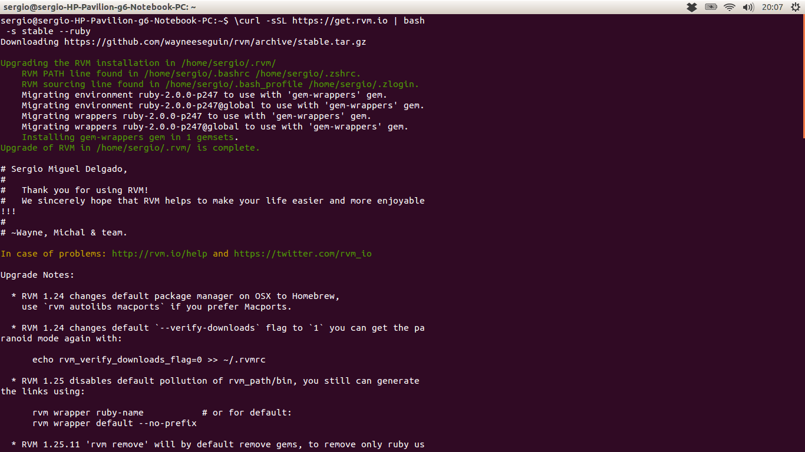
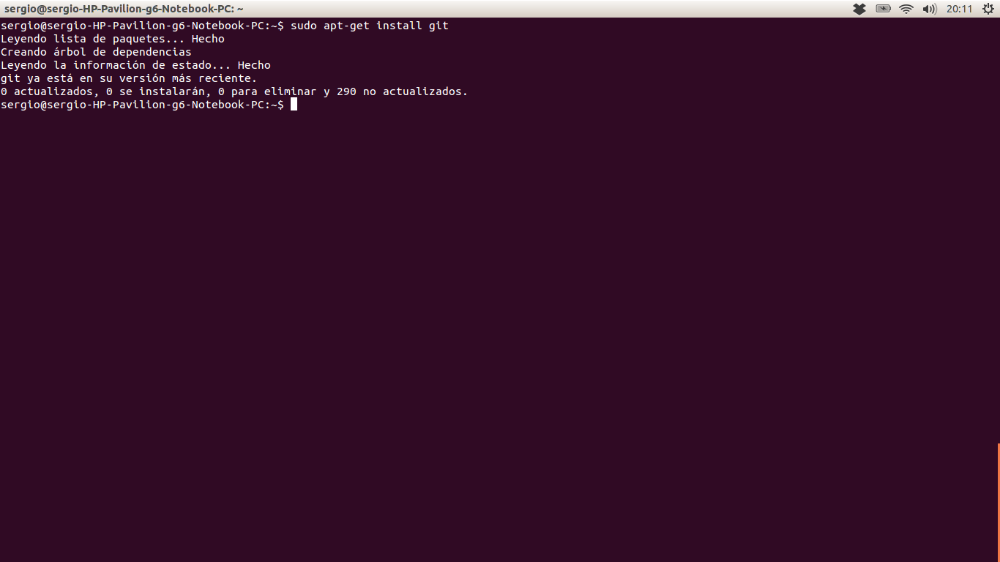

#Instalando RVM/Ruby y Git en Ubuntu.
##1. Instalar RVM/Ruby:

Este apartado no requiere más que **un sencillo comando**:

*$ \curl -sSL https://get.rvm.io | bash -s stable --ruby*

Una vez ejecutado este comando en la terminal, ya habremos instalado por completo nuestro **Ruby Version Manager**.

##2. Instalar Git:

Para instalar Git, necesitas tener las siguientes librerías de las que Git depende: *curl, zlib, openssl, expat y libiconv*. Para ello usaremos la siguiente línea de comando:

*$ sudo apt-get install libcurl4-gnutls-dev libexpat1-dev gettext \libz-dev libssl-dev*

A continuación, para completar la instalación solo tendremos que utilizar el clásico comando de Ubuntu "apt-get install":

*$ sudo apt-get install git*

